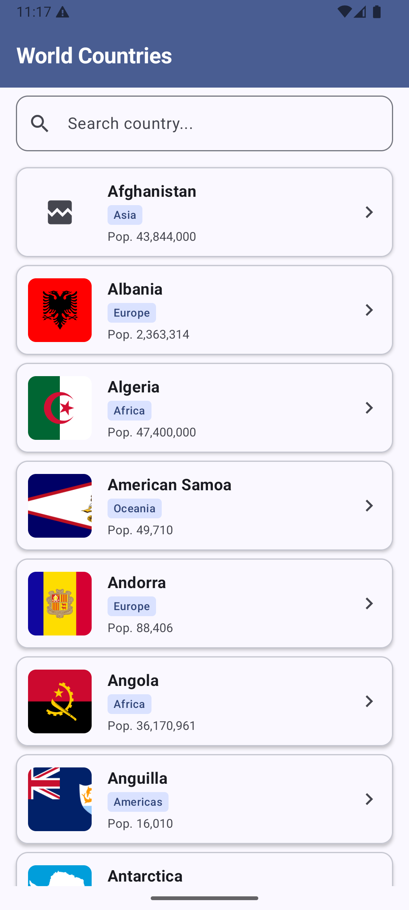
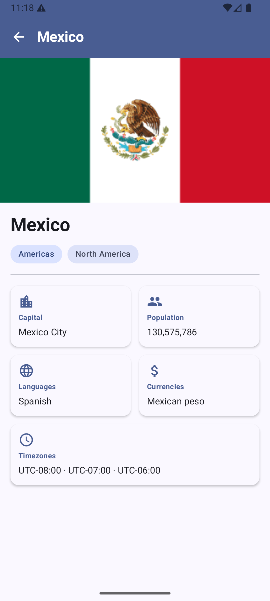
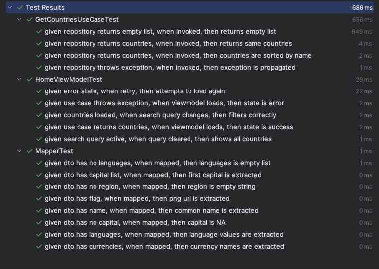

# World Countries App

An Android application that displays information about countries around the world, built as part of a technical challenge.

## Screenshots

| Home Screen | Detail Screen |
|---|---|
|  |  |

## Tests



## Tech Stack

| Category | Technology |
|---|---|
| Language | Kotlin |
| UI | Jetpack Compose |
| Architecture | Clean Architecture + MVVM |
| Dependency Injection | Hilt |
| Networking | Retrofit + OkHttp |
| Image Loading | Coil |
| Async | Coroutines + StateFlow |
| Testing | JUnit4 + MockK |

## Architecture

This project follows **Clean Architecture** principles, divided into three layers:

```
app/
└── src/main/java/com/example/atomchallenge/
    ├── data/
    │   ├── remote/
    │   │   ├── api/          # Retrofit service interface
    │   │   └── dto/          # API response models + Mappers
    │   └── repository/       # Repository implementation
    ├── domain/
    │   ├── model/            # Business models
    │   ├── repository/       # Repository interfaces
    │   └── usecase/          # Business logic use cases
    ├── presentation/
    │   ├── home/             # Country list screen
    │   ├── detail/           # Country detail screen
    │   └── navigation/       # Navigation setup
    └── di/                   # Hilt dependency injection modules
```

### Why Clean Architecture?

- **Separation of concerns** — each layer has a single responsibility
- **Testability** — business logic is isolated and easy to test
- **Maintainability** — changes in one layer don't affect others

## Features

- Display list of countries with flag, name, region and population
- Search countries by name (local filtering)
- Country detail screen with capital, languages, currencies and timezones
- Loading, success and error states
- Retry on error
- Dark mode support

## API

This app uses the [REST Countries API](https://restcountries.com/) to fetch country data.

## Testing

The project includes **17 unit tests** covering:

| Test Class | Coverage |
|---|---|
| `MapperTest` | DTO to Domain model transformation |
| `GetCountriesUseCaseTest` | Business logic and sorting |
| `HomeViewModelTest` | UI state management and search filtering |

Run all tests with:

```bash
./gradlew test
```

## Requirements

- Android Studio Hedgehog or later
- Android 7.0 (API 24) or higher

## How to Run

1. Clone the repository

```bash
git clone https://github.com/AdanGabrielBalbuenaLuna/AtomChallenge.git
```

2. Open the project in Android Studio

3. Run the app on an emulator or physical device